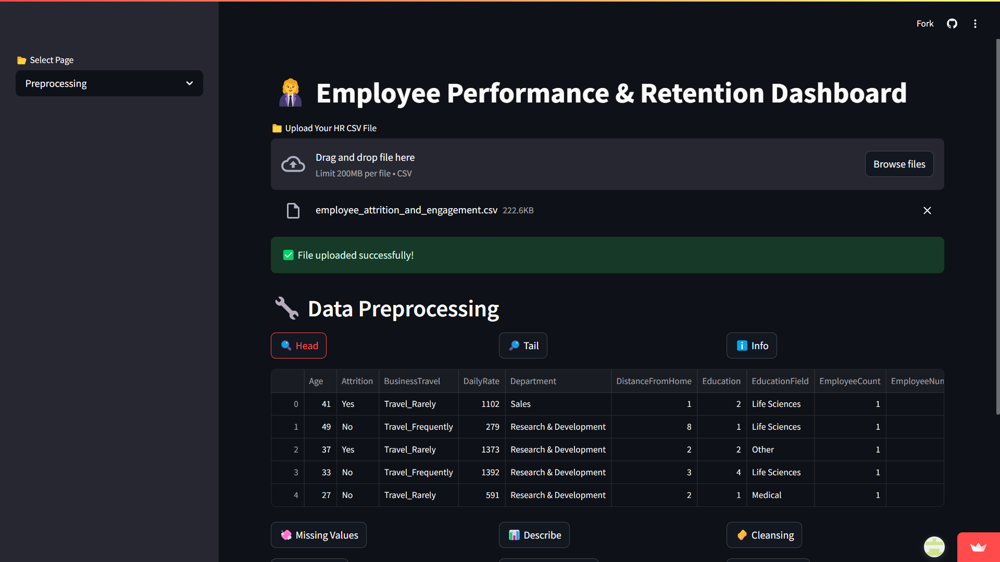
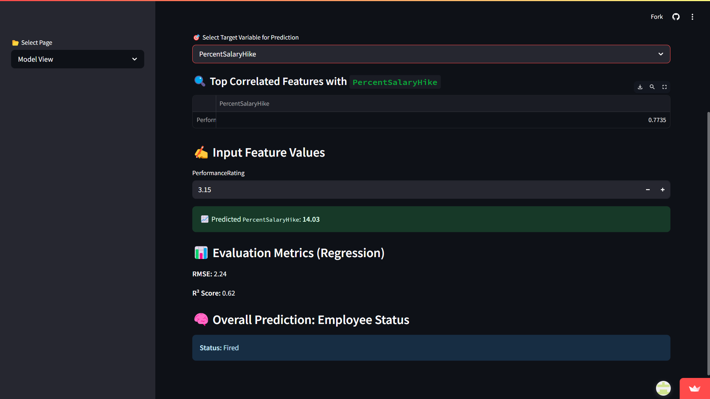
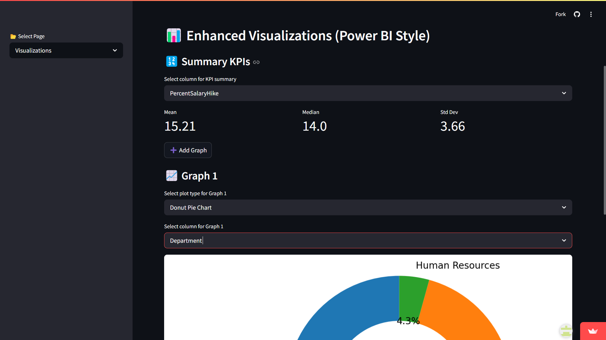

# 🚀 Employee Performance & Attrition Prediction

Predicting employee performance and attrition using Machine Learning models — featuring data preprocessing, visual analytics, and an interactive dashboard.

---

## 👨‍💻 Authors

- **[Kammari Sadguru Sai](https://www.linkedin.com/in/kammarisadgurusai)** (23955A6715)  
- **[Eerla Venkatesh](https://www.linkedin.com/in/eerla-venkatesh-9a95a6292)** (23955A6718)  
Department of Computer Science and Engineering (Data Science)  
*Institute of Aeronautical Engineering, Dundigal, Hyderabad, Telangana.*

---

## 📚 Table of Contents
1. [Introduction](#1-🧠-introduction)  
2. [Data Analysis & Preprocessing](#2-🔍-data-analysis--preprocessing)  
3. [Model Development & Evaluation](#3-🤖-model-development--evaluation)  
4. [Data Visualization & Dashboard](#4-📈-data-visualization--dashboard)  
5. [Deployment](#5-🚀-deployment)  
6. [Resources](#📦-resources)  
7. [How to Use](#🙌-how-to-use)  

---

## 1. 🧠 Introduction

Employee attrition is a major concern for organizations. This project leverages machine learning techniques to **predict employee attrition and performance** using factors like job satisfaction, work-life balance, compensation, and more.

---

## 2. 🔍 Data Analysis & Preprocessing

### ✅ Key Highlights:
- Total of **1470 rows** and **35 features**.
- **Missing values** handled.
- **Redundant or non-informative columns** removed.
- **Feature selection** done using a **correlation heatmap**.

📸 **Screenshot: Preprocessing**  


---

## 3. 🤖 Model Development & Evaluation

### 🧪 Models Implemented:
- **RandomForestClassifier** – for predicting employee attrition (Yes/No).
- **RandomForestRegressor** – for analyzing performance scores.

### 📊 Evaluation Metrics:
- **Classification:** Accuracy, Precision, Recall, F1-Score  
- **Regression:** RMSE (Root Mean Squared Error), R² Score

📸 **Screenshot: Model Training**  


---

## 4. 📈 Data Visualization & Dashboard

An interactive dashboard built using **Streamlit** for intuitive exploration and performance monitoring.

### 🎨 Key Features:
- **Heatmaps, Boxplots, Histograms, Donut Charts**
- **KPI Cards:** Mean, Median, Standard Deviation
- **Dynamic Filters** to explore key insights
- Clear **correlation visuals** between features and target labels

📸 **Screenshot: Visualization**  


---

## 5. 🚀 Deployment

- 🌐 **Live App:** [empguess.streamlit.app](https://empguess.streamlit.app)  
- 💻 **GitHub Repository:** [github.com/KammariSadguruSai/EmployeePerformancePrediction](https://github.com/KammariSadguruSai/EmployeePerformancePrediction)

---

## 📦 Resources

- 📁 **Dataset Used:** [Attrition](https://www.kaggle.com/datasets/ashrakatsaeed/attrition)

---

## 🙌 How to Use

1. **Clone the repository**
   ```bash
   git clone https://github.com/KammariSadguruSai/EmployeePerformancePrediction.git
   cd EmployeePerformancePrediction
2. **Install dependencies**
   ```bash
   pip install -r requirements.txt
3. **Run the Streamlit application**
   ```bash
   streamlit run app.py
